# 🎬 Movigo

<p align="center">
  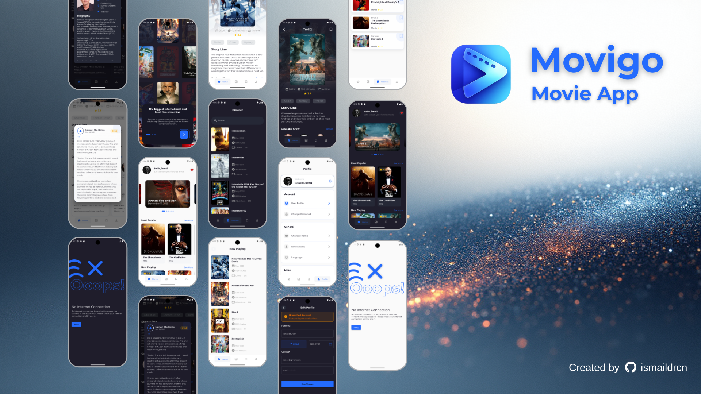
</p>

<p align="center">
  <strong>A modern, feature-rich movie discovery application built with Flutter</strong>
</p>

<p align="center">
  <a href="#features">Features</a> •
  <a href="#tech-stack">Tech Stack</a> •
  <a href="#installation">Installation</a> •
  <a href="#screenshots">Screenshots</a>
</p>

---

## 📖 About

Movigo is an open-source movie and TV show information application that allows users to discover, explore, and save their favorite movies. Built with Flutter for cross-platform compatibility, it provides a seamless experience across Android platform.

## ✨ Features

### 🎥 Movie Discovery

- **Trending Movies** - Browse currently trending movies with a beautiful carousel slider
- **Top Rated** - Discover the highest-rated movies of all time
- **Now Playing** - See what's currently in theaters
- **Upcoming Movies** - Preview upcoming releases with trailers
- **Search** - Find any movie with real-time search functionality with debounce optimization

### 🎬 Movie Details

- Comprehensive movie information including:
  - Overview and storyline
  - Release date, runtime, and genres
  - User ratings and vote counts
  - Cast and crew information with detailed profiles
  - User reviews and comments
  - YouTube trailer integration
  - Production companies and countries

### 👤 User Features

- **Authentication System**
  - User registration with email verification
  - Secure login/logout
  - Password reset functionality
  - Profile management (avatar, personal info, gender, birthdate)
- **Wishlist Management**
  - Add/remove movies to personal wishlist
  - Persistent wishlist across sessions
  - Quick access from movie details

### 🎨 UI/UX Features

- **Onboarding Flow** - Beautiful 3-step onboarding experience for new users
- **Dark/Light Theme** - Full theme support with system preference detection
- **Responsive Design** - Optimized for all screen sizes
- **Smooth Animations** - Fluid transitions and micro-interactions
- **Offline Support** - Graceful handling of network connectivity issues

### 🔒 Security

- Secure token-based authentication
- Flutter Secure Storage for sensitive data
- API interceptors for automatic token management

## 🛠️ Tech Stack

### Frontend

| Technology   | Purpose                     |
| ------------ | --------------------------- |
| **Flutter**  | Cross-platform UI framework |
| **Dart**     | Programming language        |
| **Provider** | State management            |
| **GoRouter** | Navigation & routing        |

### Networking & Data

| Package                    | Purpose                       |
| -------------------------- | ----------------------------- |
| **Dio**                    | HTTP client with interceptors |
| **Flutter Secure Storage** | Secure local storage          |
| **Connectivity Plus**      | Network state monitoring      |

### UI Components

| Package                    | Purpose                     |
| -------------------------- | --------------------------- |
| **Carousel Slider**        | Movie carousel on home page |
| **YouTube Player Flutter** | Trailer playback            |
| **Flutter Markdown**       | Legal documents rendering   |
| **Animated Snack Bar**     | User notifications          |
| **Toggle Switch**          | Cast/Crew toggle            |

### Utilities

| Package                 | Purpose                        |
| ----------------------- | ------------------------------ |
| **Intl**                | Date formatting & localization |
| **Email Validator**     | Form validation                |
| **Visibility Detector** | Scroll-based optimizations     |

## 🚀 Installation

### Prerequisites

- Flutter SDK (3.0 or higher)
- Dart SDK (3.0 or higher)
- Android Studio / VS Code
- Backend API server ([see Backend Setup](https://github.com/ismaildrcn/movigo-backend-py))

### Steps

1. **Clone the repository**

   ```bash
   git clone https://github.com/ismaildrcn/movigo.git
   cd movigo
   ```

2. **Install dependencies**

   ```bash
   flutter pub get
   ```

3. **Configure API endpoint**

   Update the base URL in `lib/data/datasources/remote.dart`:

   ```dart
   static const String baseUrl = "http://YOUR_API_URL:8000";
   ```

   By default, API access is granted via [render.com](https://imdb-app-backend-py.onrender.com).

   This API has been shared with everyone. It remains in sleep mode when not in use. Therefore, you may need to wait a while for it to wake up upon the first startup.

4. **Run the application**

   ```bash
   # For Android
   flutter run -d android
   ```

### Backend Setup

This application requires a backend API server. The API should provide endpoints for:

- `/v1/api/auth/*` - Authentication endpoints
- `/v1/api/remote/movie/*` - Movie data (proxied from TMDB)
- `/v1/api/users/*` - User management & wishlist

## 🎯 Key Screens

| Screen            | Description                                |
| ----------------- | ------------------------------------------ |
| **Home**          | Trending carousel, categorized movie lists |
| **Movie Details** | Full movie info, trailer, cast, reviews    |
| **Search**        | Real-time movie search with debounce       |
| **Wishlist**      | Saved movies for logged-in users           |
| **Profile**       | User settings, theme toggle, legal docs    |
| **Credits**       | Detailed cast & crew with person profiles  |

## 🔐 Authentication Flow

```
┌─────────────┐    ┌──────────────┐    ┌─────────────┐
│  Onboarding │ -> │    Login     │ -> │    Home     │
└─────────────┘    └──────────────┘    └─────────────┘
                          │
                          v
                   ┌──────────────┐
                   │   Register   │
                   └──────────────┘
                          │
                          v
                   ┌──────────────┐
                   │ Email Verify │
                   └──────────────┘
```

## Screenshots

|                                                      |                                                      |                                                      |                                                      |                                                        |
| ---------------------------------------------------- | ---------------------------------------------------- | ---------------------------------------------------- | ---------------------------------------------------- | ------------------------------------------------------ |
| 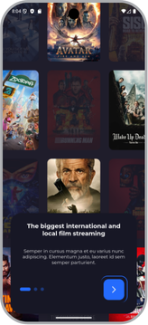 | 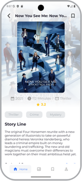 | 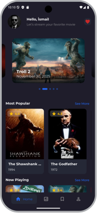 | 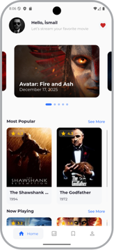 | 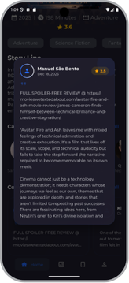   |
| 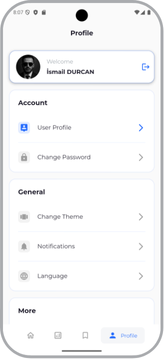 | 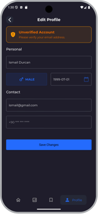 | 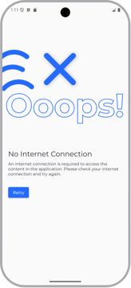 | 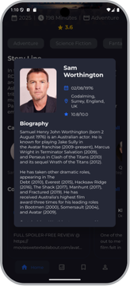 | 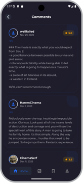 |

## 📄 License

This project is open source and available under the [MIT License](LICENSE).

## 📞 Contact

For questions or feedback, please open an issue on GitHub.

---
